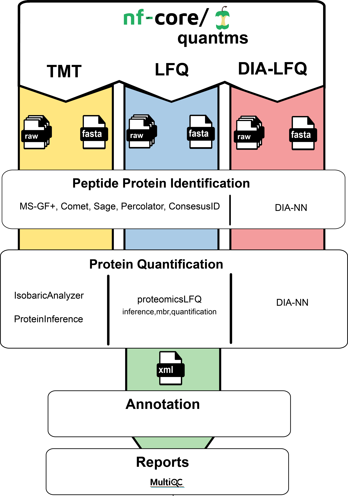
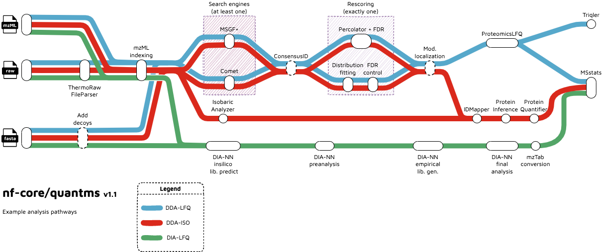

#  

[](https://github.com/nf-core/quantms/actions?query=workflow%3A%22nf-core+CI%22)
[](https://github.com/nf-core/quantms/actions?query=workflow%3A%22nf-core+linting%22)
[](https://nf-co.re/quantms/results)
[](https://doi.org/10.5281/zenodo.XXXXXXX)

[](https://www.nextflow.io/)
[](https://docs.conda.io/en/latest/)
[](https://www.docker.com/)
[](https://sylabs.io/docs/)

[](https://nfcore.slack.com/channels/quantms)
[](https://twitter.com/nf_core)
[](https://www.youtube.com/c/nf-core)

## Introduction

<!-- TODO nf-core: Write a 1-2 sentence summary of what data the pipeline is for and what it does -->

**nf-core/quantms** is a bioinformatics best-practice analysis pipeline for Quantitative Mass Spectrometry (MS). Currently, the workflow supports three major MS-based analytical methods: (i) Data dependant acquisition (DDA) label-free and Isobaric quantitation (e.g. TMT, iTRAQ); (ii) Data independent acquisition (DIA) label-free quantification (for details see our in-depth documentation on [quantms](https://quantms.readthedocs.io/en/latest/)).

<p align="center">
    
</p>

The pipeline is built using [Nextflow](https://www.nextflow.io), a workflow tool to run tasks across multiple compute infrastructures in a very portable manner. It uses Docker/Singularity containers making installation trivial and results highly reproducible. The [Nextflow DSL2](https://www.nextflow.io/docs/latest/dsl2.html) implementation of this pipeline uses one container per process which makes it much easier to maintain and update software dependencies. Where possible, these processes have been submitted to and installed from [nf-core/modules](https://github.com/nf-core/modules) in order to make them available to all nf-core pipelines, and to everyone within the Nextflow community!

<!-- TODO nf-core: Add full-sized test dataset and amend the paragraph below if applicable -->

On release, automated continuous integration tests run the pipeline on a full-sized dataset on the AWS cloud infrastructure. This ensures that the pipeline runs on AWS, has sensible resource allocation defaults set to run on real-world datasets, and permits the persistent storage of results to benchmark between pipeline releases and other analysis sources. The results obtained from the full-sized test can be viewed on the [nf-core website](https://nf-co.re/quantms/results). This gives you a hint on which reports and file types are produced by the pipeline in a standard run. The automatic continuous integration tests evaluate different workflows, including the peptide identification, quantification for LFQ, LFQ-DIA, and TMT test datasets.

## Pipeline summary

<!-- TODO nf-core: Fill in short bullet-pointed list of the default steps in the pipeline -->

The quantms allows uses to perform analysis in three main type of analytical MS-based quantitative methods: DDA-LFQ, DDA-ISO, DIA-LFQ. Each of these workflows share some processes but also includes their own steps. In summary:

DDA-LFQ:

1. RAW file conversion to mzML ([`thermorawfileparser`](https://github.com/compomics/ThermoRawFileParser))
2. Peptide identification using [`comet`](https://uwpr.github.io/Comet/) and/or [`msgf+`](https://github.com/MSGFPlus/msgfplus)
3. Re-scoring peptide identifications [`percolator`](https://github.com/percolator/percolator)
4. Peptide identification FDR [`openms fdr tool`](https://github.com/ypriverol/quantms/blob/dev/modules/local/openms/falsediscoveryrate/main.nf)
5. Modification localization [`luciphor`](https://github.com/dfermin/lucXor)
6. Quantification: Feature detection [`proteomicsLFQ`](https://abibuilder.informatik.uni-tuebingen.de/archive/openms/Documentation/nightly/html/UTILS_ProteomicsLFQ.html)
7. Protein inference and quantification [`proteomicsLFQ`](https://abibuilder.informatik.uni-tuebingen.de/archive/openms/Documentation/nightly/html/UTILS_ProteomicsLFQ.html)
8. QC report generation [`pmultiqc`](https://github.com/bigbio/pmultiqc)
9. Normalization, imputation, significance testing with [`MSstats`](https://github.com/VitekLab/MSstats)

DDA-ISO:

1. RAW file conversion to mzML ([`thermorawfileparser`](https://github.com/compomics/ThermoRawFileParser))
2. Peptide identification using [`comet`](https://uwpr.github.io/Comet/) and/or [`msgf+`](https://github.com/MSGFPlus/msgfplus)
3. Re-scoring peptide identifications [`percolator`](https://github.com/percolator/percolator)
4. Peptide identification FDR [`openms fdr tool`](https://github.com/ypriverol/quantms/blob/dev/modules/local/openms/falsediscoveryrate/main.nf)
5. Modification localization [`luciphor`](https://github.com/dfermin/lucXor)
6. Extracts and normalizes isobaric labeling [`IsobaricAnalyzer`](https://abibuilder.informatik.uni-tuebingen.de/archive/openms/Documentation/nightly/html/TOPP_IsobaricAnalyzer.html)
7. Protein inference [`ProteinInference`](https://abibuilder.informatik.uni-tuebingen.de/archive/openms/Documentation/nightly/html/TOPP_ProteinInference.html) or [`Epifany`](https://abibuilder.informatik.uni-tuebingen.de/archive/openms/Documentation/nightly/html/UTILS_Epifany.html) for bayesian inference.
8. Protein Quantification [`ProteinQuantifier`](https://abibuilder.informatik.uni-tuebingen.de/archive/openms/Documentation/nightly/html/TOPP_ProteinQuantifier.html)
9. QC report generation [`pmultiqc`](https://github.com/bigbio/pmultiqc)
10. Normalization, imputation, significance testing with [`MSstats`](https://github.com/VitekLab/MSstats)

DIA-LFQ:

1. RAW file conversion to mzML ([`thermorawfileparser`](https://github.com/compomics/ThermoRawFileParser))
2. DIA-NN analysis [`dia-nn`](https://github.com/vdemichev/DiaNN/)
3. Generation of output files (msstats)
4. QC reports generation [`pmultiqc`](https://github.com/bigbio/pmultiqc)

## Functionality overview

A graphical overview of suggested routes through the pipeline depending on context can be seen below.

<p align="center">
    
</p>

## Quick Start

1. Install [`Nextflow`](https://www.nextflow.io/docs/latest/getstarted.html#installation) (`>=21.10.3`)

2. Install any of [`Docker`](https://docs.docker.com/engine/installation/), [`Singularity`](https://www.sylabs.io/guides/3.0/user-guide/), [`Podman`](https://podman.io/), [`Shifter`](https://nersc.gitlab.io/development/shifter/how-to-use/) or [`Charliecloud`](https://hpc.github.io/charliecloud/) for full pipeline reproducibility _(please only use [`Conda`](https://conda.io/miniconda.html) as a last resort; see [docs](https://nf-co.re/usage/configuration#basic-configuration-profiles))_

3. Download the pipeline and test it on a minimal dataset with a single command:

   ```console
   nextflow run nf-core/quantms -profile test,YOURPROFILE --input project.sdrf.tsv --database protein.fasta --outdir <OUTDIR>
   ```

   Note that some form of configuration will be needed so that Nextflow knows how to fetch the required software. This is usually done in the form of a config profile (`YOURPROFILE` in the example command above). You can chain multiple config profiles in a comma-separated string.

   > - The pipeline comes with config profiles called `docker`, `singularity`, `podman`, `shifter`, `charliecloud` and `conda` which instruct the pipeline to use the named tool for software management. For example, `-profile test,docker`.
   > - Please check [nf-core/configs](https://github.com/nf-core/configs#documentation) to see if a custom config file to run nf-core pipelines already exists for your Institute. If so, you can simply use `-profile <institute>` in your command. This will enable either `docker` or `singularity` and set the appropriate execution settings for your local compute environment.
   > - If you are using `singularity` and are persistently observing issues downloading Singularity images directly due to timeout or network issues, then you can use the `--singularity_pull_docker_container` parameter to pull and convert the Docker image instead. Alternatively, you can use the [`nf-core download`](https://nf-co.re/tools/#downloading-pipelines-for-offline-use) command to download images first, before running the pipeline. Setting the [`NXF_SINGULARITY_CACHEDIR` or `singularity.cacheDir`](https://www.nextflow.io/docs/latest/singularity.html?#singularity-docker-hub) Nextflow options enables you to store and re-use the images from a central location for future pipeline runs.
   > - If you are using `conda`, it is highly recommended to use the [`NXF_CONDA_CACHEDIR` or `conda.cacheDir`](https://www.nextflow.io/docs/latest/conda.html) settings to store the environments in a central location for future pipeline runs.
   >
   > * The pipeline comes with config profiles called `docker`, `singularity`, `podman`, `shifter`, `charliecloud` and `conda` which instruct the pipeline to use the named tool for software management. For example, `-profile test,docker`.
   > * Please check [nf-core/configs](https://github.com/nf-core/configs#documentation) to see if a custom config file to run nf-core pipelines already exists for your Institute. If so, you can simply use `-profile <institute>` in your command. This will enable either `docker` or `singularity` and set the appropriate execution settings for your local compute environment.
   > * If you are using `singularity`, please use the [`nf-core download`](https://nf-co.re/tools/#downloading-pipelines-for-offline-use) command to download images first, before running the pipeline. Setting the [`NXF_SINGULARITY_CACHEDIR` or `singularity.cacheDir`](https://www.nextflow.io/docs/latest/singularity.html?#singularity-docker-hub) Nextflow options enables you to store and re-use the images from a central location for future pipeline runs.
   > * If you are using `conda`, it is highly recommended to use the [`NXF_CONDA_CACHEDIR` or `conda.cacheDir`](https://www.nextflow.io/docs/latest/conda.html) settings to store the environments in a central location for future pipeline runs.

4. Start running your own analysis!

   <!-- TODO nf-core: Update the example "typical command" below used to run the pipeline -->

   ```console
   nextflow run nf-core/quantms -profile <docker/singularity/podman/shifter/charliecloud/conda/institute> --input project.sdrf.tsv --database database.fasta --outdir <OUTDIR>
   ```

## Documentation

The nf-core/quantms pipeline comes with a stand-alone [full documentation](https://quantms.readthedocs.io/en/latest/) including examples, benchmarks, and detailed explanation about the data analysis of proteomics data using quantms. In addition, quickstart documentation of the pipeline can be found in: [usage](https://nf-co.re/quantms/usage), [parameters](https://nf-co.re/quantms/parameters) and [output](https://nf-co.re/quantms/output).

## Credits

nf-core/quantms was originally written by: Chengxin Dai ([@daichengxin](https://github.com/daichengxin)), Julianus Pfeuffer ([@jpfeuffer](https://github.com/jpfeuffer)) and Yasset Perez-Riverol ([@ypriverol](https://github.com/ypriverol)).

We thank the following people for their extensive assistance in the development of this pipeline:

- Timo Sachsenberg ([@timosachsenberg](https://github.com/timosachsenberg))
- Wang Hong ([@WangHong007](https://github.com/WangHong007))

<!-- TODO nf-core: If applicable, make list of people who have also contributed -->

## Contributions and Support

If you would like to contribute to this pipeline, please see the [contributing guidelines](.github/CONTRIBUTING.md).

For further information or help, don't hesitate to get in touch on the [Slack `#quantms` channel](https://nfcore.slack.com/channels/quantms) (you can join with [this invite](https://nf-co.re/join/slack)). In addition, users can get in touch using our [discussion forum](https://github.com/bigbio/quantms/discussions)

## Citations

<!-- TODO nf-core: Add citation for pipeline after first release. Uncomment lines below and update Zenodo doi and badge at the top of this file. -->
<!-- If you use  nf-core/quantms for your analysis, please cite it using the following doi: [10.5281/zenodo.XXXXXX](https://doi.org/10.5281/zenodo.XXXXXX) -->

<!-- TODO nf-core: Add bibliography of tools and data used in your pipeline -->

An extensive list of references for the tools used by the pipeline can be found in the [`CITATIONS.md`](CITATIONS.md) file.

You can cite the `nf-core` publication as follows:

> **The nf-core framework for community-curated bioinformatics pipelines.**
>
> Philip Ewels, Alexander Peltzer, Sven Fillinger, Harshil Patel, Johannes Alneberg, Andreas Wilm, Maxime Ulysse Garcia, Paolo Di Tommaso & Sven Nahnsen.
>
> _Nat Biotechnol._ 2020 Feb 13. doi: [10.1038/s41587-020-0439-x](https://dx.doi.org/10.1038/s41587-020-0439-x).
