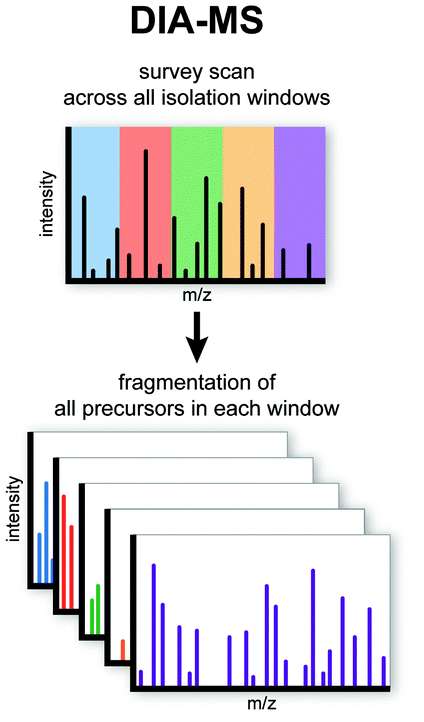

Data-independent acquisition (DIA) quantification
==================================================

In mass spectrometry, data-independent acquisition (DIA) is a method of molecular structure determination in which all ions within a selected m/z range are fragmented and analyzed in a second stage of tandem mass spectrometry [DOR2014]_.

The major difference between DDA and DIA analytical methods is the way the spectra is acquired. Tandem mass spectra are acquired either by fragmenting all ions that enter the mass spectrometer at a given time (called broadband DIA) or by sequentially isolating and fragmenting ranges of m/z. DIA is an alternative to data-dependent acquisition (:doc:`dda`) where a fixed number of precursor ions are selected and analyzed by tandem mass spectrometry. This is the main reason why the peptide identification protocol is different between (:doc:`identification`) and major search engines like :doc:`msgf` and :doc:`comet` do not work with DIA data.

Data analysis of DIA data is based in two major strategies library-based and library-free peptide identification. The classical approach to DIA data analysis uses a spectral library of peptides, which are queried in the DIA samples and quantified in case of their presence. However, this method has been has multiple drawbacks that make difficult automatic reanalysis of public proteomics data:

- In addition to the DIA data, the corresponding DDA needs to be deposited in public databases and properly annotated.
- The need for spectral libraries previously created from DDA data. Previously to the DIA analysis, the user MUST analyze the DDA data and create the spectral libraries which involves multiple steps including peptide identification, RT transitions alignments, etc.

Some of these challenges has been highlighted in multiple publications [MAXDIA2022]_ [MATHIAS2021]_. quantms aims to make reanalysis of public proteomics data easy, fast, scalable and as reproducible as possible. For that reason library-free data analysis is not the best option.

.. tip:: For library-based data analysis we recommend the nf-core pipeline `diaproteomics <https://nf-co.re/diaproteomics>`_ [LEON2021]_

Additionally to library-based algorithms, several library-free approaches exist, and spectral predictions have been successfully used for DIA data analysis. Library-free approaches has two main ways to perform the analysis, by un-multiplex the MSn spectra and perform the analysis as a common DDA or by using predicted in-silico libraries from protein databases. The predicted algorithm uses the protein database to generate the spectra library. In case reliability of library-free identifications is achieved, DIA can additionally be employed in a discovery mode, without biases imposed by a library and, at the same time, with certainty that the identified set of proteins contains, at most, a predefined percentage of false positives—for example, 1%, as is standardly applied in DDA-based proteomics.

.. note:: By 2022, DIA data analysis is an evolving field in proteomics, new algorithm for prediction of libraries from databases are still emerging and new tools are created for pseudo spectra identification. By 2022, we use `diann <https://github.com/vdemichev/DiaNN>`_ as the main tool to perform library-free data analysis. We will continue evolving this pipeline and performing benchmarks and comparisons with other existing tools.

DIANN data analysis
--------------------

quantms, uses `DIANN <https://github.com/vdemichev/DiaNN>`_ for DIA library-based and library-free data processing. DIA-NN [DEMI2019]_ is a universal software for data-independent acquisition (DIA) proteomics data processing. In 2018, DIA-NN opened a new chapter in proteomics, introducing a number of algorithms which enabled reliable, robust and quantitatively accurate large-scale experiments using high-throughput methods.

In order to analyze the DIA dataset the pipeline needs the acquisition method properly annotated in the SDRF:  `comment[proteomics data acquisition method]` with value for each sample `NT=Data-Independent Acquisition;AC=NCIT:C161786`:

.. csv-table:: Example DIA SDRF annotated (only relevant columns are highlighted)
   :header: "source name", "characteristics[organism]", "characteristics[organism part]", "characteristics[spiked compound]", "characteristics[biological replicate]", "assay name", "comment[data file]", "comment[technical replicate]", "comment[fraction identifier]", "comment[proteomics data acquisition method]", "comment[label]", "comment[modification parameters]", "comment[modification parameters]", "comment[cleavage agent details]", "comment[precursor mass tolerance]", "comment[fragment mass tolerance]", "factor value[spiked compound]"

   "Sample-1", "Escherichia coli K-12", "whole plant", "CT=Mixture;CN=UPS1;QY=0.1 fmol", "1", "run 1", "RD139_Narrow_UPS1_0_1fmol_inj1.raw", "1", "1", "NT=Data-Independent Acquisition;AC=NCIT:C161786", "AC=MS:1002038;NT=label free sample", "NT=Oxidation;MT=Variable;TA=M;AC=Unimod:35", "NT=Carbamidomethyl;TA=C;MT=fixed;AC=UNIMOD:4", "AC=MS:1001313;NT=Trypsin", "10 ppm", "20 mmu", "CT=Mixture;CN=UPS1;QY=0.1 fmol"

Similarly to the DDA workflow (see :doc:`lfq`, :doc:`iso`), we aim to make DIA-NN parallelize and distribute most of the tasks in the cluster.

The first step of the workflow, translate the SDRF parameters into DIA-NN configuration parameters, including port-translation modification, enzyme, etc. For the developers and bioinformaticians, the details can be found in `diann to parameters <https://github.com/bigbio/quantms/blob/dev/bin/prepare_diann_parameters.py>`_ .

The second step of the workflow, generate an in-silico spectral library from a FASTA sequence database if predefined transition libraries are not provided.
The current step is run with the following parameters than can be changed in the commandline:

- `--min_pr_mz & --max_pr_mz`: Minimum & Maximum precursor mz.
- `--min_fr_mz & --max_fr_mz`: Minimum & Maximum fragment mz.
- `--allowed_missed_cleavages`: Number of missed-cleavages.
- `--min_peptide_length & --max_peptide_length`: Minimum & Maximum length of the peptides for the search.
- `--min_precursor_charge & --max_precursor_charge`: Minimum & Maximum charge states.
- `--max_mods`: Maximum number of modifications allows for a peptide.

The third step of the workflow, preliminary analysis of individual raw file based on in-silico predicted or predefined transition library. The .quant files for each raw file that contains IDs and quant info will be saved. This step is run with the following
parameters that can be changed in the commandline:

- `--mass_acc_automatic`: Mass accuracies are set to automatic, will be determined independently for different runs and enable `quick-mass-acc` algorithm.
- `--mass_acc_ms2`: Sets the MS2 mass accuracy to N ppm.
- `--mass_acc_ms1`: Sets the MS1 mass accurary to N ppm.
- `--scan_window_automatic`: Scan window is set to automatic.
- `--scan_window`: Sets the scan window radius.
- `-time_corr_only`: Low RAM & high speed mode enabled.
- `diann_speclib`: Predefined transition library. DIA-NN supports comma-separated (.csv) or tab-separated (.tsv, .xls or .txt), .speclib (compact format used by DIA-NN), .sptxt (SpectraST, experimental) and .msp (NIST, experimental) library files. Important: the library must not contain non-fragmented precursor ions as 'fragments': each fragment ion must actually be produced by the peptide backbone fragmentation.
- `random_preanalysis`: Use random/subset files for library search.
- `empirical_assembly_ms_n`: Number of MS runs to use for empirical assembly.

.. Note:: The MS1 and MS2 mass accuracy only support ppm unit in DIA branch. quantms will automatically enable `--mass_acc_automatic=true` to determine accuracy by DIA-NN if Da unit is provided. In addition, quantms also supports uses random/subset files to empirical library assembly and library search.
This improves the speed of operation, but may bring about performance degradation.

The fourth step of the workflow, assemble an empirical spectral library from .quant files. The `IDs RT & IM profiling` mode is enabled. The following parameters are used that can be changed in the commandline:

- `--mass_acc_automatic`: as above.
- `--mass_acc_ms2`: as above.
- `--mass_acc_ms1`: as above.
- `--scan_window_automatic`: as above.
- `--scan_window`: as above.

The fifth step of the workflow, final analysis of individual raw file used empirical spectral library (much faster than the preliminary step).
Now, mass accuracies & scan window will be fixed here in case they were not fixed for step 2. The recommended settings for this experiment will be extracted from log file produced by step 3 and then passed to DIA-NN.
High-precision quantification mode and protein inference are enabled by `--no-ifs-removal` and `--relaxed-prot-inf`.

The last step of the workflow, summaries the information and then generates report files based on the .quant files. It is run with the following parameters than can be changed in the commandline:

- `--pg_level`: Controls the protein inference mode, with 0 - isoforms, 1 - protein names (as in UniProt), 2 - gene names
- `species-genes`: Instructs DIA-NN to add the organnism identifier to the gene names.
- `protein_level_fdr_cutoff`: Q-value threshold.

**Match between runs (MBR)**: In MBR is allowed, peptides identified by tandem mass spectra in one run are transferred to another by inference based on m/z, charge state, retention time, and ion mobility when applicable. This is done manually.

MSstats
------------

The output of DIA-NN is exported to MSstats for the downstream analysis by `diann to msstats <https://github.com/bigbio/quantms/blob/dev/bin/diann_convert.py>`_. you can read more about MSstats in :doc:`msstats`.

Triqler
------------

The output of DIA-NN is exported to Triqler for the downstream analysis, you can read more about Triqler in :doc:`triqler`.
The `searchScore` is computed by the dia converter as 1-Q.value. The details can be found `diann to triqler <https://github.com/bigbio/quantms/blob/dev/bin/diann_convert.py>`_.

Important technical notes
--------------------------

By 2022, the quantms DIA workflow based on DIA-NN has the following drawbacks:

- **Conda NOT supported**: The steps of the DIA branch of the pipeline can only be run using **docker**, and **singularity**. The quantms team is working hard to also support conda. You can follow the `quantms discussions <https://github.com/bigbio/quantms/discussions>`_

References
------------

.. [DOR2014] Doerr, A. DIA mass spectrometry. Nat Methods 12, 35 (2015). https://doi.org/10.1038/nmeth.3234

.. [MAXDIA2022] Sinitcyn P, Hamzeiy H, Salinas Soto F, Itzhak D, McCarthy F, Wichmann C, Steger M, Ohmayer U, Distler U, Kaspar-Schoenefeld S, Prianichnikov N, Yılmaz Ş, Rudolph JD, Tenzer S, Perez-Riverol Y, Nagaraj N, Humphrey SJ, Cox J. MaxDIA enables library-based and library-free data-independent acquisition proteomics. Nat Biotechnol. 2021 Dec;39(12):1563-1573. doi: 10.1038/s41587-021-00968-7. Epub 2021 Jul 8. PMID: 34239088; PMCID: PMC8668435.

.. [MATHIAS2021] Mathias Walzer, David García-Seisdedos, Ananth Prakash, Paul Brack, Peter Crowther, Robert L. Graham, Nancy George, Suhaib Mohammed, Pablo Moreno, Irene Papathedourou, Simon J. Hubbard, Juan Antonio Vizcaíno. Implementing the reuse of public DIA proteomics datasets: from the PRIDE database to Expression Atlas. bioRxiv 2021.06.08.447493; doi: https://doi.org/10.1101/2021.06.08.447493

.. [LEON2021] Bichmann L, Gupta S, Rosenberger G, Kuchenbecker L, Sachsenberg T, Ewels P, Alka O, Pfeuffer J, Kohlbacher O, Röst H. DIAproteomics: A Multifunctional Data Analysis Pipeline for Data-Independent Acquisition Proteomics and Peptidomics. J Proteome Res. 2021 Jul 2;20(7):3758-3766. doi: 10.1021/acs.jproteome.1c00123. Epub 2021 Jun 21. PMID: 34153189.

.. [DEMI2019] Demichev V, Messner CB, Vernardis SI, Lilley KS, Ralser M. DIA-NN: neural networks and interference correction enable deep proteome coverage in high throughput. Nat Methods. 2020 Jan;17(1):41-44. doi: 10.1038/s41592-019-0638-x. Epub 2019 Nov 25. PMID: 31768060; PMCID: PMC6949130.

