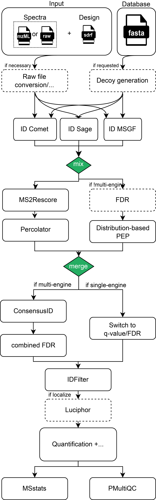

Peptide identification from fragment spectra
============================================

.. toctree::
   :maxdepth: 1

   searchengines
   rescoring
   fdr
   modlocal

The peptide identification workflow is the cornerstone of data-dependent acquisition (DDA)
quantification methods such as LFQ or TMT. To identify proteins by mass spectrometry, the proteins of interest in the sample are
digested into peptides using a proteolytic enzyme (e.g., trypsin). The complex peptide mixture is then separated by
liquid chromatography which is coupled to the mass spectrometer.

In DDA mode, the mass spectrometer first records the mass/charge (m/z) of each peptide ion and then selects
the peptide ions individually for fragmentation to obtain sequence information via MS/MS spectra (:numref:`fig_msms`).
As a result for each sample, millions of MS and corresponding MS/MS are obtained
which correspond to all peptides in the mixture.

.. _fig_msms:
.. figure:: images/msms.png
   :width: 600
   :align: center

   MS/MS spectrum.

In order to identify the MS/MS spectra, several computational algorithms and tools
can now be used to identify peptides and proteins. The most popular ones are based on protein sequence databases,
where the experimental MS/MS is compared with the theoretical MS/MS of each peptide obtained from the *in silico*
digestion of the protein database (as reviewed in [RIVEROL2014]_).



Peptide Identification
------------------------------------

The peptide identification step in the quantms pipeline can be performed (**independently** or **combined**) with two
different open-source tools : :doc:`comet` or :doc:`msgf`. The parameters for the search engine Comet or MS-GF+ are
read from the SDRF input parameters including the post-translation modifications (annotated with UNIMOD accessions),
precursor and fragment ion mass tolerances, etc. The only parameter that MUST be provided by commandline to the
quantms workflow is the psm and peptide FDR threshold ``psm_pep_fdr_cutoff`` (default value ``0.01``).

.. note:: Using multiple database search engine combined can yield up to **15% more peptides** compared to using only
          one search engine. However, you need to be aware that adding another search engine will increase the CPU
          computing time. :doc:`identification-benchmarks`.

When multiple search engines are used ```--search_engines msgf,comet``` the results for each input file are
combined into one single identification file including the combination of all listed search engines.
To bring scores from different search engines to a comparable level, the posterior (error) probability output
from either Percolator or the distribution-fitting approach is used.

The OpenMS tool `ConsensusID <https://abibuilder.informatik.uni-tuebingen.de/archive/openms/Documentation/nightly/html/TOPP_ConsensusID.html>`_
is used to combine the results from different search engines [NAHNSEN2011]_. ConsensusID provides multiple algorithms to combine
PSMs from multiple search engines. The default option and more widely tested is `best`. In this option, the **best**
chooses the PSM with the highest probability. Here it is enough for each engine to provide only one top hit.

.. note:: The other two more advanced algorithms are: **PEPMatrix** - calculates a matrix of similarities across sequences
          of different engines to increase the weight for sequences that have a similar counterpart for another engine.
          **PEPIons** - calculates a matrix of the number of shared matched ions across sequences of different engines
          to increase the weight for sequences that have a similar counterpart for another engine.


References
---------------------------

.. [RIVEROL2014]
    Perez-Riverol Y, Wang R, Hermjakob H, Müller M, Vesada V, Vizcaíno JA. Open source libraries and frameworks for mass spectrometry based proteomics: a developer's perspective. Biochim Biophys Acta. 2014 Jan;1844(1 Pt A):63-76. doi: 10.1016/j.bbapap.2013.02.032. Epub 2013 Mar 1. PMID: 23467006; PMCID: PMC3898926.

.. [NAHNSEN2011]
   Nahnsen S, Bertsch A, Rahnenführer J, Nordheim A, Kohlbacher O. Probabilistic consensus scoring improves tandem mass spectrometry peptide identification. J Proteome Res. 2011 Aug 5;10(8):3332-43. doi: 10.1021/pr2002879. Epub 2011 Jun 23. PMID: 21644507.

