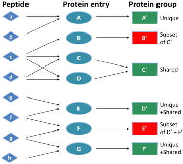

Protein inference
=================

.. toctree::
   :maxdepth: 1

   identification
   epifany

Assembling peptides identified (:doc:`identification`) from tandem mass spectra into a list of proteins, referred to as protein inference, is a critical step in proteomics research [HUANG2012]_. Due to the existence of shared peptides across multiple proteins, it is very difficult to determine which proteins are present in the sample.

The peptide-centric approach is by design flawed by the presence of shared peptides also named degenerated peptides whose
sequence is shared between different proteins. When such peptides are encountered, it is common practice to group
the matching proteins into ambiguity groups [NES2012]_.

Over the years multiple algorithms has been developed to map the identified peptide list into a final protein list.
Various tools are available for this task, integrated in a larger environment like the Trans-Proteomic Pipeline (TPP),
MaxQuant or PeptideShaker, or standalone like IDPicker.

.. note:: Different software will give you different proteins from the same peptide list. In addition different
          software's in combination with different peptide identification tools can give completly different results (read our previous benchmark in the topic [AUDA2017]_)

In quantms provides two major methods for protein inference: **bayesian** and **aggregation** methods. Both with their corresponding parameters and configurations.

.. note:: By default, quantms uses aggregation method to perform protein inference.

Bayesian inference
-----------------------------

Bayesian inference is performed using the Epifany (:doc:`epifany`) algorithm [PFEU2020]_. To perform protein inference,
Epifany combines a loopy belief propagation algorithm with convolution trees for efficient processing of Bayesian networks.

To enable protein inference in quantms, the user must provide the following parameter: `--protein_inference_method 'bayesian'`.

Aggregation inference
----------------------------

In the aggregation method, the algorithm aggregates the scores of peptide sequences that match a protein accession.
Only the top PSM for a peptide is used. By default it also annotates the number of peptides used for the calculation
and can be used for further filtering.

In order to compute the aggregation score, the algorithm uses three methods: 'best' (default option), 'Product', or
'Sum'. If the users wants to change the method for the score calculation should use the following option: `--protein_score`

Additional inference parameters
------------------------------------

Both methods **bayesian** and **aggregation** shares multiple parameters to perform the protein inference.

1. Top PSMs (`top_PSMs`): The algorithms by default use the top first psms to perform the protein inference. However,
the user can use more PSMs if they want by changing the parameter: `top_PSMs 3`.

2. Minimum peptides per proteins (`min_peptides_per_protein`): The minimun number of peptides for a protein to be considered
for the inference. The default value is `1`, but users can use the parameter `min_peptides_per_protein` to change the value.

Protein FDR
---------------------------------

Protein FDR is applied in LFQ analysis by the proteomicsLFQ tool (:doc:`lfq`) and in the isobaric analysis by the protein inference
step.

The protein FDR estimation procedures of both method is estimated using the the concatenated target-decoy database
and the equation FDR=(𝑁decoy+1)𝑁target. Groups are counted as decoy if they consist of only decoy proteins. FDRs are then
converted to q-values.

By default, quantms uses the "picked" target/decoy strategy (`picked_FDR`) which is recommended
for large proteomics experiments [SAV2015]_.

.. note:: The “picked” TDS [SAV2015]_ addresses decoy protein overestimation typically observed for the classic TDS and takes into
          account that the probability of creating a false positive PSM is not equal for all proteins.
          For example, large target and decoy proteins are more prone to accumulating high scoring random matches and
          are likely to accrue higher protein scores than small proteins both of which artificially inflates the
          protein FDR. All of these can be at least partially addressed by simple data harmonizing steps and
          conceptually extending the line of reasoning from the commonly employed approach of concatenating target
          and decoy sequences for database searching, to treating target and decoy versions of a given protein
          sequence as a pair. For proteins that have PSMs/PCMs in both their respective target and decoy sequences,
          the algorithm will only “pick” the one with the highest score and discard the other.
          The almost perfect overlap of target and decoy distributions in the low-scoring region suggests little or
          no bias and, therefore, explains the superior performance of the picked TDS, in line with prior work on
          the theoretical treatment of the matter.

.. toctree::
   :maxdepth: 1

   epifany
   identification

References
------------------------

.. [HUANG2012] Huang T, Wang J, Yu W, He Z. Protein inference: a review. Brief Bioinform. 2012 Sep;13(5):586-614. doi: 10.1093/bib/bbs004. Epub 2012 Feb 28. PMID: 22373723.

.. [NES2012] Nesvizhskii AI, Aebersold R. Interpretation of shotgun proteomic data: the protein inference problem. Mol Cell Proteomics. 2005 Oct;4(10):1419-40. doi: 10.1074/mcp.R500012-MCP200. Epub 2005 Jul 11. PMID: 16009968.

.. [AUDA2017] Audain E, Uszkoreit J, Sachsenberg T, Pfeuffer J, Liang X, Hermjakob H, Sanchez A, Eisenacher M, Reinert K, Tabb DL, Kohlbacher O, Perez-Riverol Y. In-depth analysis of protein inference algorithms using multiple search engines and well-defined metrics. J Proteomics. 2017 Jan 6;150:170-182. doi: 10.1016/j.jprot.2016.08.002. Epub 2016 Aug 4. PMID: 27498275.

.. [PFEU2020] Pfeuffer J, Sachsenberg T, Dijkstra TMH, Serang O, Reinert K, Kohlbacher O. EPIFANY: A Method for Efficient High-Confidence Protein Inference. J Proteome Res. 2020 Mar 6;19(3):1060-1072. doi: 10.1021/acs.jproteome.9b00566. Epub 2020 Feb 13. PMID: 31975601; PMCID: PMC7583457.

.. [SAV2015] Savitski MM, Wilhelm M, Hahne H, Kuster B, Bantscheff M. A Scalable Approach for Protein False Discovery Rate Estimation in Large Proteomic Data Sets. Mol Cell Proteomics. 2015 Sep;14(9):2394-404. doi: 10.1074/mcp.M114.046995. Epub 2015 May 17. PMID: 25987413; PMCID: PMC4563723.

