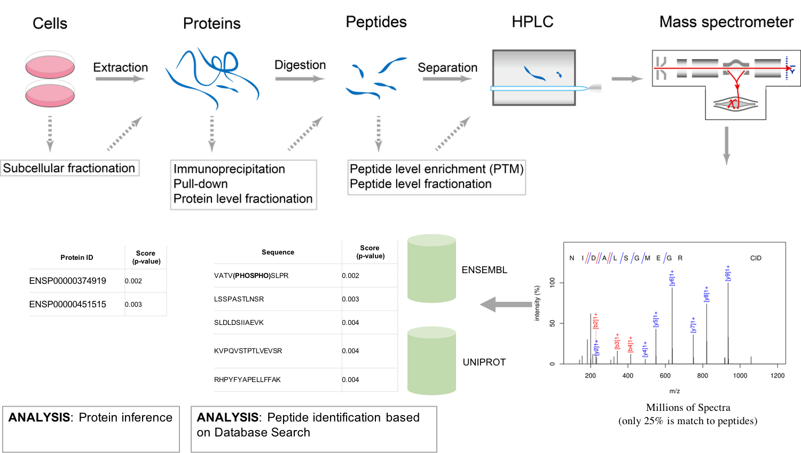

Quantitative mass spectrometry data analysis
==================================

Bottom-up proteomics is a common method to identify proteins
and characterize their amino acid sequences and post-translational
modifications by proteolytic digestion of proteins prior to analysis
by mass spectrometry. In bottom-up or shotgun proteomics[1], the protein extract
is enzymatically digested, followed by one or more dimensions of
separation of the peptides by liquid chromatography coupled to
mass spectrometry.
By comparing the masses of the proteolytic peptides or their
tandem mass spectra with those predicted from a sequence database,
peptides can be identified and multiple peptide identifications
assembled into a protein identification.

Different quantification strategies
-------------------------

Quantification strategies in proteomics depend on the acquisition strategy
used on the mass spectrometer and how/if the peptides were labelled with
special reagents or isotopes.
Acquisition strategies can be divided into the highly reproducible
:doc:`data-independent acquisition (DIA) strategies <dia>`
(e.g., SWATH) and the well-proven, sensitive
:doc:`data-dependent acquisition (DDA) <dda>`.
With respect to usually more expensive labelling strategies, the most commonly
employed ones are the isobaric chemical labels :doc:`iTraq and TMT <tmt>` and the metabolic
labelling strategies (usually based on isotopically labelled amino acids) like SILAC (TODO link)
(not yet supported by this pipeline).
The advantage of labels is that they allow multiplexing of samples and
avoiding retention alignment and the implied requirement of having a
very reproducible chromatography.

Workflow-based analysis
-----------------------

While there exist tools for the analysis of shotgun proteomics data (like MaxQuant TODO cite), most of these
tools are designed as single-tiered/monolithic software application where tasks cannot be distributed or evaluated
separately, therefore limiting the scalability and reproducibility of the data analysis [ref 2].
The different sub-workflows of the `quantms workflow <https://github.com/bigbio/quantms>`_ on the other hand
enable the distribution of all the different steps of a peptide identification and quantification workflow in
cloud or HPC environments through the usage of nextflow (TODO cite). It also features rich quality control
reports and different methods for automated downstream statistical post-processing including reports on
significance analysis for differential expression which all can be emailed to you after successful completion of
the pipeline.
The workflow can be configured solely by an SDRF input file for easy one-command-reanalyses of PRIDE datasets
but also offers extensive configurabilty on either a web-based or a guided command-line interface provided
through its integration into nf-core (TODO cite). The membership in nf-core additionally secures best practices
of open and collaborative development of the pipeline including continuous testing after every contribution.
The used software is strictly versioned through the exclusive usage of (bio-)conda packages (TODO cite) whose
association with the biocontainer ecosystem (TODO cite) also
allows us to provide a workflow profile for several containerization softwares (like docker, singularity, podman, etc.).
Containerization ensures an even more reproducible environment for your analyses.
The pipeline can easily be supervised on-the-fly via nf-tower (TODO link). Failed runs can be debugged by investigating
the rich pipeline execution reports.

|

.. sidebar:: Subworkflows and tools
    :subtitle: Here you can find information about individual subworkflows and tools:

    - :doc:`Peptide identification <identification>`
        - :doc:`Peptide search engines <searchengines>`
            - :doc:`Comet <comet>`
            - :doc:`MSGF+ <msgf>`
        - :doc:`PSM rescoring <rescoring>`
            - :doc:`Distribution-based <idpep>`
            - :doc:`Percolator <percolator>`
        - :doc:`ConsensusID <consensusid>`
        - :doc:`False discovery rates <fdr>`
        - :doc:`Modification localization <modlocal>`
    - :doc:`Label-free quantification <lfq>`
        - :doc:`Peptide identification <identification>`
        - :doc:`ProteomicsLFQ metatool <proteomicslfq>`
        - :doc:`Protein inference <inference>`
    - :doc:`Isobaric labelled quantification <iso>`
        - :doc:`Peptide identification <identification>`
        - :doc:`Isobaric quantification <isobaricquantifier>`
        - :doc:`Protein inference <inference>`
    - :doc:`Data-independent acquistion <dia>`
        - :doc:`DIAUmpire <diaumpire>`
        - :doc:`OpenSwath <openswath>`
    - :doc:`Statistical postprocessing <statistics>`
        - :doc:`MSstats <msstats>`
        - :doc:`Triqler <triqler>`
    - :doc:`Quality control <qc>`
        - :doc:`pmultiqc`
        - :doc:`PTXQC <ptxqc>`

quantms workflow in a nutshell
--------------------------------

Mass spectrometry quantitative data analysis can be divided in the following main steps.
Make sure to follow the links to get to know more about the implementation
details of specific steps in the pipeline.

- Peptide identification
    Through matching of peptide fragment spectra
        - with protein database and known modifications [implemented]
        - with protein database and unknown modifications [in development]
        - with spectrum database [currently unsupported]
        - without database (de novo) [currently unsupported]
- Peptide quantification
    - DDA
        - label-free
        Through finding interesting features (or 3D peaks) on MS1 level, consisting
        of isotopic traces with the same elution profile (either targeted
        at locations with identifications or untargeted), aligning and
        matching them between runs, potentially requantifiying missing features
        and lastly integrating the intensity of the raw peaks in those features.

        - isobaric labels
        Through comparing the intensity of reporter ions arising from the
        fragmentation of the isobaric label in the fragment spectra (either
        in the MS2 spectrum used for identification or in separate MS3 spectra
        (SPS) TODO link)

        - metabolic labels [currently unsupported]
        Through feature finding (as in label-free) and linking features with a mass shift depending
        on the isotopes in the label. Matching modifications in the fragment spectra
        if available can be used to confirm links.
    - DIA
        - (transition) library-free
        Through creating a library of transitions to extract and compare
        based on the results from peptide search engines, aligning the extracted
        peak groups, and performing rigorous statistical
        testing of those peak group to classify them correctly.

        - with a library of transitions [currently unsupported? TODO]

- Protein inference and quantification
    This is done to map ambiguous peptides to the mostly likely proteins of origin
    and to create protein groups based on the ambiguity level between them.
    Heuristics based on inference scores and groupings can then help in deciding which peptides
    to use for quantification of which protein. Aggregation of quantities
    to the protein level can be performed by several different rules (e.g., top-3)
    or left to the downstream statistical tools.

- Downstream (statistical) data analysis
    Downstream data analysis tools like MSstats and Triqler can
    perform more elaborate normarlization, imputation, aggregation
    and statistical significance testing based on the raw intensities,
    protein associations and scores from the upstream pipeline.

- Quality control
    Our chosen and developed quality control tools gather required
    information from the resulting mzTab file and optionally
    intermediate results to provide statistics and summary plots of
    important quality control metrics like (TODO).

.. image:: images/quantms.png
   :width: 450
   :align: center

References
--------------------------------

[1] Aebersold, R., Mann, M. Mass spectrometry-based proteomics. Nature 422, 198–207 (2003). https://doi.org/10.1038/nature01511
[2] Perez-Riverol Y, Moreno P. Scalable Data Analysis in Proteomics and Metabolomics Using BioContainers and Workflows Engines. Proteomics. 2020 May;20(9):e1900147. doi: 10.1002/pmic.201900147. Epub 2019 Dec 18. PMID: 31657527.
