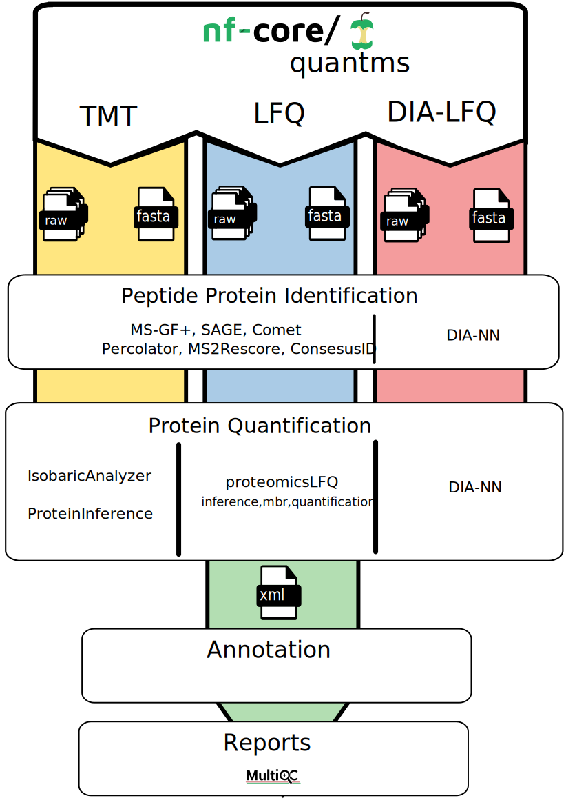

Quantitative mass spectrometry data analysis
==================================

Bottom-up proteomics is a common method to identify proteins and characterize their amino acid sequences and post-translational modifications by proteolytic digestion of proteins prior to analysis by mass spectrometry. In bottom-up proteomics, the protein extract is enzymatically digested, followed by one or more dimensions of separation of the peptides by liquid chromatography coupled to mass spectrometry, a technique known as shotgun proteomics [1]. By comparing the masses of the proteolytic peptides or their tandem mass spectra with those predicted from a sequence database, peptides can be identified and multiple peptide identifications assembled into a protein identification.

.. image:: images/ms-proteomics.png
   :width: 350

.. sidebar:: Pipelines and tools
   :subtitle: **It can make your life easier** if you want to explore individual tools:

   - :doc:`identification`
   - :doc:`lfq`
   - :doc:`tmt`
   - :doc:`pquant`
   - :doc:`pmultiqc`

Mass spectrometry quantitative data analysis can be divided in three main steps:

- peptide/protein identification
- protein quantification
- downstream data analysis and quality contronl

quantms workflow in a nutshell
~~~~~~~~~~~~~~~~~~~~~~~~~~~~~~~~~

References
~~~~~~~~~~~~~~~~~

[1] Aebersold, R., Mann, M. Mass spectrometry-based proteomics. Nature 422, 198–207 (2003). https://doi.org/10.1038/nature01511
