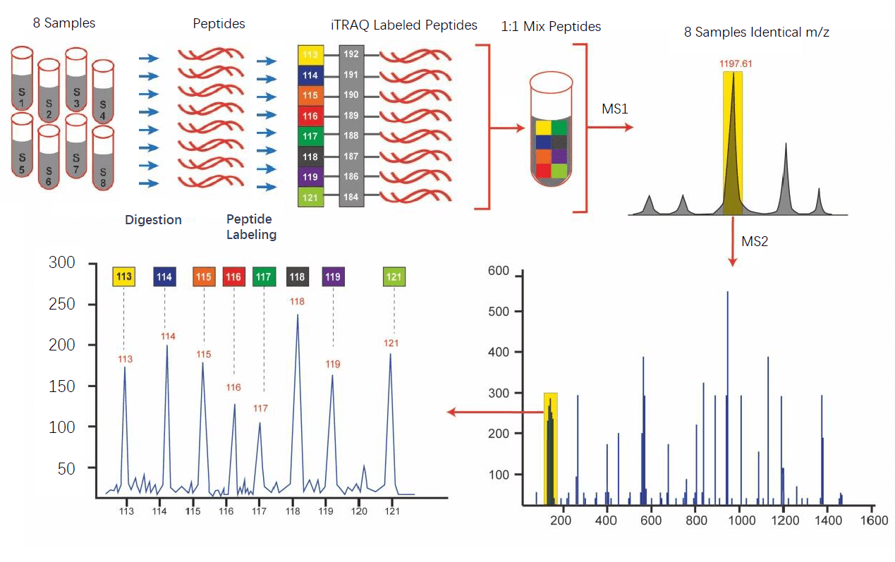

Isobaric labelling strategies
=============================

.. toctree::
   :maxdepth: 1

   identification
   epifany
   formats

Quantification with isobaric labels (TMT or iTraq) is a mass spectrometry strategy used in quantitative proteomics [CHEN2022]_. Peptides or proteins are labeled with various chemical groups that are (at least nominally) identical masses (isobaric), but vary in terms of distribution of heavy isotopes around their structure. These tags, commonly referred to as tandem mass tags, are designed so that the mass tag is cleaved at a specific linker region upon high-energy CID (HCD) during tandem mass spectrometry yielding reporter ions of different masses. The most common isobaric tags are amine-reactive tags. Isobaric labeling methods include tandem mass tags (TMT), isobaric tags for relative and absolute quantification (iTRAQ), mass differential tags for absolute and relative quantification, and dimethyl labeling. TMTs and iTRAQ methods are most common and developed of these methods.

Isobaric quantification with quantms
------------------------------

In quantms, the LFQ (:doc:`lfq`) and the isobaric pipelines shares the all the identification steps (:doc:`identification`) including peptide identification, re-scoring with percolator (:doc:`percolator`) and the peptide fdr (:doc:`fdr`) filtering. In isobaric experiments, three steps are combined in a different way compare to :doc:`lfq` workflow: protein inference, isobaric information analyzer and protein quantification.

.. note:: It is important to note, that in :doc:`lfq` experiments, the workflow uses a unique process/step and tool (**proteomicsLFQ**) to perform: feature detection, protein inference and peptide/protein quantification.

Isobaric Analyzer
------------------------------

The isobaric analyzer step extracts and normalizes isobaric labeling information from an LC-MS/MS experiment. The input of these process are the MSn spectra data in mzML files, data must be **centroid** for the tool to work properly.

quantms and the isobaric analyzer step, currently support the following analytical methods:

- iTRAQ 4-plex and 8-plex
- TMT 6-plex, 10-plex, 11-plex, and 16-plex as labeling methods.

In this step, the tool extracts the isobaric reporter ion intensities from centroided **MS2** or **MS3** data (MSn), then performs isotope correction and stores the resulting quantitation in a consensus map, in which each consensus feature represents one relevant MSn scan (e.g. HCD; see parameters select_activation and min_precursor_intensity).

.. note:: The MS level for quantification is chosen automatically, i.e. if **MS3 is present, MS2 will be ignored**. A full documentation of the Isobaric Analyzer can be found `here <https://abibuilder.informatik.uni-tuebingen.de/archive/openms/Documentation/release/latest/html/TOPP_IsobaricAnalyzer.html>`_

Importantly, in TMT/iTRAQ data analysis the user must annotated the SDRF (see :doc:`formats`) properly because the experimental design is capture from that input for the data analysis.

+--------------------+----------------------------+------------+----------------+--------------------+------------------------------+-----------------------------------------+---------------------------------------------------------+--------------------------------------------+-------------------------+
| source name        | characteristics[phenotype] | assay name | comment[label] | comment[data file] | comment[fraction identifier] | comment[modification parameters]        | comment[modification parameters]                        | comment[modification parameters]           | factor value[phenotype] |
+--------------------+----------------------------+------------+----------------+--------------------+------------------------------+-----------------------------------------+---------------------------------------------------------+--------------------------------------------+-------------------------+
| PXD014414-Sample-1 | Chondroid                  | run 1      | TMT126         | 0414.raw           | 1                            | NT=TMT6plex;AC=UNIMOD:737;TA=K;MT=Fixed | NT=TMT6plex;AC=UNIMOD:737;PP=Protein N-term;MT=Variable | NT=TMT6plex;AC=UNIMOD:737;TA=S;MT=Variable | Chondroid               |
+--------------------+----------------------------+------------+----------------+--------------------+------------------------------+-----------------------------------------+---------------------------------------------------------+--------------------------------------------+-------------------------+

.. note:: Isobaric modifications **MUST** annotated as modification parameters in the SDRF (:doc:`formats`). In addition, the label (comment[label]) is needed to define the specific channel for each sample. Channel `TMT126` will be use as the reference channel.

Protein inference
-------------------------------

Two methods are provided for protein inference in quantms: **Aggregation** and **Bayesian**. If you want to know the details please read the section :doc:`inference`

Protein Quantification
-----------------------

Compute peptide and protein abundances from annotated feature/consensus maps or from identification results. The input of this step is a consesusXML file (:doc:`formats`). Quantification is based on the intensity values of the features in the input files. Feature intensities are first accumulated to peptide abundances, according to the peptide identifications annotated to the features/feature groups. Then, abundances of the peptides of a protein are averaged to compute the protein abundance. In quantms, the peptide-to-protein step uses the (e.g. 3) most abundant proteotypic peptides per protein to compute the protein abundances. By default, quantms in isobaric workflows uses the top 3 peptides for quantification, if the user wants to change that number, it should pass the parameter `--top 4`, for example to change to top 4. This is a general version of the "top 3 approach" described in [SILVA2006]_

Similarly, only proteotypic peptides (i.e. those matching to exactly one protein) are used for protein quantification by default. Peptide/protein IDs from multiple identification runs can be handled, but will not be differentiated (i.e. protein accessions for a peptide will be accumulated over all identification runs). See section "Optional input: Protein inference/grouping results" below for exceptions to this. Peptides with the same sequence, but with different modifications are quantified separately on the peptide level, but treated as one peptide for the protein quantification (i.e. the contributions of differently-modified variants of the same peptide are accumulated).

Similar to LFQ pipeline (:doc:`lfq`), the Protein quantification steps export the following file formats (read more here :doc:`formats`): mzTab, msstats output and OpenMS protein quantitation output.

References
------------------

.. [CHEN2022] Chen X, Sun Y, Zhang T, Shu L, Roepstorff P, Yang F. Quantitative Proteomics Using Isobaric Labeling: A Practical Guide. Genomics Proteomics Bioinformatics. 2022 Jan 7:S1672-0229(22)00001-8. doi: 10.1016/j.gpb.2021.08.012. Epub ahead of print. PMID: 35007772.

.. [SILVA2006] Silva JC, Gorenstein MV, Li GZ, Vissers JP, Geromanos SJ. Absolute quantification of proteins by LCMSE: a virtue of parallel MS acquisition. Mol Cell Proteomics. 2006 Jan;5(1):144-56. doi: 10.1074/mcp.M500230-MCP200. Epub 2005 Oct 11. PMID: 16219938.

.. toctree::
   :maxdepth: 1

   identification
   inference
