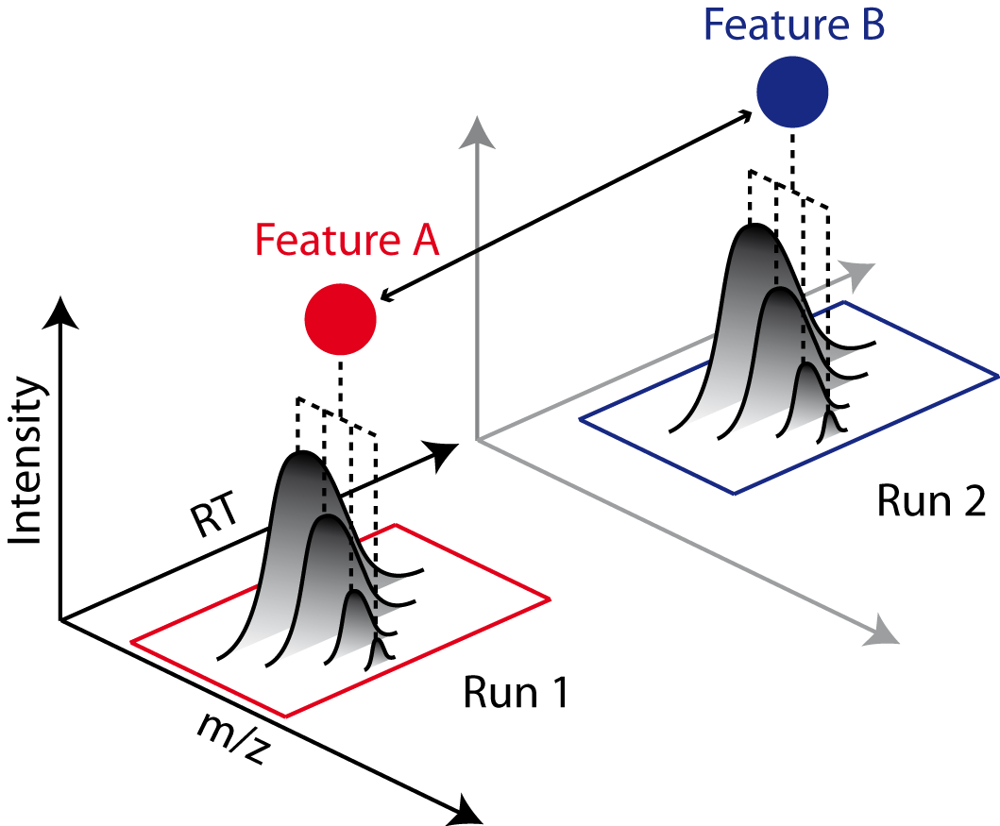

Label-free quantification with DDA (LFQ)
========================================

.. toctree::
   :maxdepth: 1

   identification
   inference
   msstats
   formats

LFQ algorithms detect isotopic patterns of eluting peptides and integrate their chromatographic intensities.

Quantification across several MS runs is obtained by determining and *linking* of corresponding peptide signals, so-called
*features*, between runs. While label-free quantification scales to a large number of experiments, it heavily relies
on correct linking of corresponding peptides. *Chromatographic retention time alignment* algorithms compensate for differences
in chromatographic elution and reduce mislinked peptides across maps.

proteomicsLFQ metatool (OpenMS)
-----------------------------------

In quantms, The proteomicsLFQ tool performs label-free quantification of peptides and proteins. This tool performs
different steps from the feature extraction to the output of the quantified peptides and proteins. proteomicsLFQ is
highly configurable depending on the type of the data analysis the user would like to perform.

Relevant Parameters
----------------------------

**Peptides used for quantification**: By default, protein quantification is performed only in unique peptides
`protein_quant='unique_peptides'`, if the users prefer to include also use shared peptides `protein_quant 'shared_peptides'`.

**Quantification Method**: LFQ analytical methods uses two main approaches for quantification intensity-based and
spectral count algorithms. By default, proteomicsLFQ uses the most reliable method intensity-based
`quantification_method = 'feature_intensity'`, however if the users wants to quantified based on spectral counting, the
can pass the following option `quantification_method 'spectral_counting'`.

**Quantify Decoys**: By default, the quantms do not quantified decoy peptide hits, this behaviour can be changed by using the parameter `quantify_decoys` and is auto-enabled when triqler output is enable (:doc:`triqler`).

Match between runs
~~~~~~~~~~~~~~~~~~~~~~~~~~~~

Match between runs (MBR) [LIM2019]_ enables to improve the quantified features. If a peptide has been quantified in more than half of all maps, the peptide is selected for MBR. In that case, the mean observed RT (and theoretical m/z) of the peptide is used to perform a second round of targeted extraction.

proteomicsLFQ supports **ID-based feature extraction** or a combined **ID-based + untargeted extraction**.

1. **ID-based feature extraction** uses targeted feature detection using RT and m/z information derived from identification data to extract features. Only identifications found in a particular MS run are used to extract features in the same run. No transfer of IDs (match between runs) is performed.
2. **ID-based + untargeted extraction** adds untargeted feature detection to obtain quantities from unidentified features. Transfer of IDs (match between runs) is performed by transferring feature identifications to coeluting, unidentified features with similar mass and RT in other runs.

To enable MBRs, the users should enable the following parameter: `--targeted_only false`

.. note:: Match between runs is performed by transferring feature identifications to coeluting, unidentified features with similar mass and RT in other runs.

Map alignment
~~~~~~~~~~~~~~~~~~~~~~~~~~

proteomicsLFQ supports two modes of alignment. **star** alignment and **tree guided** alignment.

1. **star** alignment uses the MapAlignmentAlgorithmIdentification algorithm to align all data to the reference run with the highest number of identifications.
2. **tree guided** alignment uses the MapAlignmentAlgorithmIdentification algorithm to align data. For each pair of maps, the similarity is determined based on the intersection of the contained identifications using Pearson correlation. Using hierarchical clustering together with average linkage a binary tree is produced. Following the tree, the maps are aligned, resulting in a transformed data.

By default, quantms uses start alignment method `alignment_order = 'star'` but the user can changed using the parameter alignment_order.

Output
~~~~~~~~~~~~~~~~~~~~~

Three main formats are exported as a result of porteomicsLFQ analysis (read more :doc:`formats`):

1. mzTab file with analysis results
2. Analysis results for statistical downstream analysis in MSstats and Triqler
3. ConsensusXML file for visualization and further processing in OpenMS

.. toctree::
   :maxdepth: 1

   identification
   inference
   msstats
   formats

References
-----------------------

.. [LIM2019] Lim MY, Paulo JA, Gygi SP. Evaluating False Transfer Rates from the Match-between-Runs Algorithm with a Two-Proteome Model. J Proteome Res. 2019 Nov 1;18(11):4020-4026. doi: 10.1021/acs.jproteome.9b00492. Epub 2019 Oct 2. PMID: 31547658; PMCID: PMC7346880.
