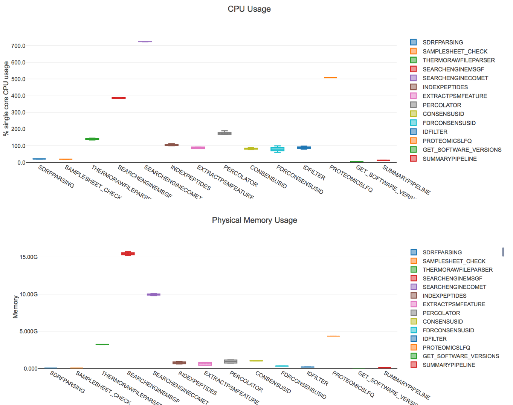

MS-GF+ peptide search engine
============================

`MS-GF+ <https://github.com/MSGFPlus/msgfplus>`_: MS-GF+ (aka MSGF+ or MSGFPlus) [KIM2014]_ performs peptide identification by scoring MS/MS spectra against peptides derived from a protein sequence database. MSG-GF+ is released under specific `License from California University <https://github.com/MSGFPlus/msgfplus/blob/master/LICENSE.txt>`_.

.. note:: In quantms, msgf+ has proved to identified more than **15%** PSMs than :doc:`comet`. However, users of cloud infrastructure needs to consider that
          msgf+ may slow the data processing and consume more memory than :doc:`coment`.

In quantms, PSMs are exported from the search engine into .idXML (read more :doc:`formats`) without filtering for the re-scoring (see :doc:`identification`) step with percolator. The pipeline stores these original file results in the result folder under `searchenginemsgf`.

References
------------------

.. [KIM2014] Sangtae Kim and Pavel A Pevzner. Nat Commun. MS-GF+ makes progress towards a universal database search tool for proteomics.
2014 Oct 31; 5:5277. doi: 10.1038/ncomms6277.
PubMed ID 25358478
