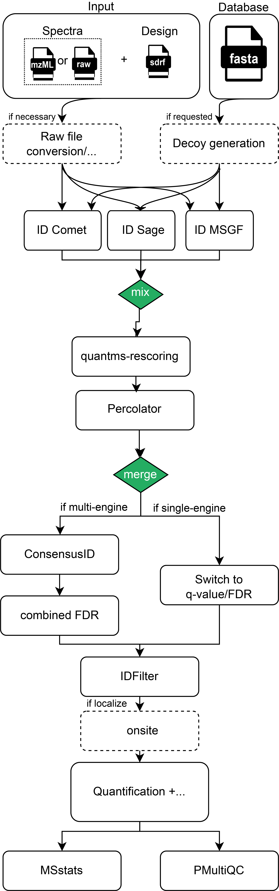

# bigbio/quantms: Output

## Introduction

This document describes the output produced by the pipeline. Most plots are taken from the pMultiQC report, which summarises results at the end of the pipeline.

The directories listed below will be created in the results directory after the pipeline has finished. All paths are relative to the top-level results directory.

## Pipeline overview

The pipeline is built using [Nextflow](https://www.nextflow.io/) and processes data using the following steps for DDA-LFQ and DDA-ISO data:

1. (optional) Conversion of spectra data to indexedMzML: Using ThermoRawFileParser if Thermo Raw or using OpenMS' FileConverter if just an index is missing
2. (optional) Decoy database generation for the provided DB (fasta) with OpenMS
3. Database search with either MSGF+ and/or Comet through OpenMS adapters
4. (optional) Performs LC-MS predictors such as MS²PIP and DeepLC to add new peptide spectrum match (PSM) features by MS2Rescore
5. (optional) Add spectrum signal-to-noise (SNR) features for Percolator rescore
6. (optional) Merge different MS runs by samples or whole projects
7. PSM rescoring Percolator
8. If multiple search engines were chosen, the results are combined with OpenMS' ConsensusID
9. If multiple search engines were chosen, a combined FDR is calculated
10. Single run PSM/Peptide-level FDR filtering
11. If localization of modifications was requested, onsite is applied.
12. (**DDA-LFQ**) Protein inference and label-free quantification based on spectral counting or MS1 feature detection, alignment and integration with OpenMS' ProteomicsLFQ. Performs an additional experiment-wide FDR filter on protein (and if requested peptide/PSM-level).
13. (**DDA-ISO**) Extracts and normalizes isobaric labeling
14. (**DDA-ISO**) Protein inference using the OpenMS ProteinInference tool. In addition, protein FDR filtering is performed in this step for Isobaric datasets (TMT, iTRAQ).
15. (**DDA-ISO**) Protein Quantification
16. Generation of QC reports using pMultiQC, a library for QC proteomics data analysis.

As an example, a rough visualization of the DDA identification subworkflow can be seen here:



## Output structure

Output will be saved to the folder defined by the parameter `--outdir`. Each step of the workflow exports different files and reports with the specific data, peptide identifications, protein quantifications, etc. Most of the pipeline outputs are [HUPO-PSI](https://www.psidev.info/) standard file formats:

- [mzML](https://www.psidev.info/mzML): The mzML format is an open, XML-based format for mass spectrometer output files.
- [QPX](https://bigbio.github.io/qpx/): the columnar Parquet + MuData quantification dataset that is the pipeline's published quantification artifact.

### Default Output Structure

By default, quantms organizes output files in a structured way, with specific directories for different types of outputs. The structure varies slightly depending on the workflow type (ISO, LFQ, etc.), but follows a consistent organization pattern.

#### Common directories across all workflows:

- `pipeline_info/`: Contains Nextflow pipeline information, execution reports, and software versions
- `sdrf/`: Contains SDRF files, OpenMS configs, and other experimental design files
- `pmultiqc/`: Contains pMultiQC reports and visualizations
  - `multiqc_data/`: Raw data used by pMultiQC
  - `multiqc_plots/`: Visualizations in different formats
    - `png/`: PNG format plots
    - `svg/`: SVG format plots
    - `pdf/`: PDF format plots

#### ISO quantification workflow output structure:

```
results_iso/
├── pipeline_info/             # Nextflow pipeline information
├── sdrf/                      # SDRF files and configs
├── quant_tables/              # Quantification tables and results
└── pmultiqc/                  # pMultiQC reports
    ├── multiqc_data/
    └── multiqc_plots/
        ├── pdf/
        ├── png/
        └── svg/
```

#### LFQ quantification workflow output structure:

```
results_lfq/
├── pipeline_info/             # Nextflow pipeline information
├── sdrf/                      # SDRF files and configs
├── spectra/                   # Spectra-related data (only present if --mzml_features is enabled)
│   └── mzml_statistics/       # Statistics about mzML files
├── quant_tables/              # Quantification tables and results
└── pmultiqc/                  # pMultiQC reports
    ├── multiqc_data/
    └── multiqc_plots/
        ├── pdf/
        ├── svg/
        └── png/
```

#### LFQ identification workflow output structure:

```
results_lfq_dda_id/
├── pipeline_info/             # Nextflow pipeline information
├── sdrf/                      # SDRF files and configs
├── spectra/                   # Spectra-related data (only present if --mzml_features is enabled)
│   └── mzml_statistics/       # Statistics about mzML files
├── psm_tables/                # PSM tables from identification pipeline
└── pmultiqc/                  # pMultiQC reports
    └── multiqc_data/
```

#### Localize workflow output structure:

```
results_localize/
├── pipeline_info/             # Nextflow pipeline information
├── sdrf/                      # SDRF files and configs
├── quant_tables/              # Quantification tables and results
└── pmultiqc/                  # pMultiQC reports
    ├── multiqc_plots/
    │   ├── svg/
    │   ├── pdf/
    │   └── png/
    └── multiqc_data/
```

### Verbose Output Structure

For more detailed output with all intermediate files, you can use the verbose output configuration by providing the config parameter `-c verbose_modules` when running the pipeline. This will use the `verbose_modules` configuration. It can be useful for debugging or detailed analysis of the pipeline's steps.

The verbose output structure preserves all intermediate files and organizes them in a more detailed directory structure. Here's an example of the verbose output structure for an LFQ analysis:

```
results/
├── pipeline_info/             # Nextflow pipeline information
├── sdrf/                      # SDRF files and configs
├── spectra/                   # Spectra-related data (only present if --mzml_features is enabled)
│   ├── mzml_indexing/         # Indexed mzML files
│   │   └── out/
│   └── mzml_statistics/       # Statistics about mzML files
├── peptide_identification/    # Peptide identification results
│   ├── comet/                 # Comet search engine results
│   └── sage/                  # SAGE search engine results
│   └── msgf/                  # MSGF search engine results
├── peptide_postprocessing/    # Post-processing of peptide identifications
│   ├── psm_features/          # PSM features extraction
│   ├── psm_clean/             # Cleaned PSM data
│   ├── percolator/            # Percolator rescoring results
│   ├── consensusid/           # ConsensusID results
│   ├── fdr_consensusid/       # FDR calculation results
│   └── id_filter/             # Filtered identification results
├── quant_tables/              # Quantification tables and results
└── pmultiqc/                  # pMultiQC reports
    ├── multiqc_plots/
    │   ├── svg/
    │   ├── png/
    │   └── pdf/
    └── multiqc_data/
```

### Key Output Files

> [!NOTE]
> DIA (Data Independent Acquisition) workflow outputs have been moved to the dedicated [quantmsdiann](https://github.com/bigbio/quantmsdiann) pipeline. Please refer to that pipeline for DIA-specific output files and documentation.

Depending on the workflow type, the main output files will be found in the following directories:

- `quant_tables/`: Contains all quantification results including the QPX dataset, MSstats-compatible input files, and other quantification tables
- `psm_tables/`: Contains PSM-level results from the identification pipeline in parquet format
- `pmultiqc/`: Contains quality control reports and visualizations

The specific files include:

- DDA-LFQ and DDA-ISO quantification results:
  - `qpx/` - [QPX](https://bigbio.github.io/qpx/) dataset published flat: the `psm`/`feature`/`pg` parquet views + `run`/`sample`/`ontology`/`provenance`/`dataset` metadata parquets + the MuData `.h5mu` container — the published quantification artifact
  - `quant_tables/*_msstats_in.csv` - [MSstats-ready](#msstats-ready-quantity-tables) quantity tables

## Output description

### Nextflow pipeline info

[Nextflow](https://www.nextflow.io/docs/latest/tracing.html) provides excellent functionality for generating various reports relevant to the running and execution of the pipeline. This will allow you to troubleshoot errors with the running of the pipeline, and also provide you with other information such as launch commands, run times and resource usage.

<details markdown="1">
<summary>Output files</summary>

`pipeline_info/`:

- Reports generated by Nextflow: `execution_report.html`, `execution_timeline.html`, `execution_trace.txt` and `pipeline_dag.dot`/`pipeline_dag.svg`.
- Reports generated by the pipeline: `pipeline_report.html`, `pipeline_report.txt` and `software_versions.yml`. The `pipeline_report*` files will only be present if the `--email` / `--email_on_fail` parameter's are used when running the pipeline.
- Reformatted samplesheet files used as input to the pipeline: `samplesheet.valid.csv`.
- `params_<timestamp>.json` containing the command line provided parameters. Some parameters are overwritten if an SDRF file is used.

</details>

> Note. These parameters are overwritten if an SDRF file is used. Even if they are set
> in the parameters, the SDRF file has precedence.
>
> - labelling_type
> - dissociationmethod
> - fixedmodifications
> - variablemodifications
> - precursormasstolerance
> - precursormasstoleranceunit
> - fragmentmasstolerance
> - fragmentmasstoleranceunit
> - enzyme
> - acquisition_method

### File types

#### Spectra

Quantms main format for spectra is the open [mzML](https://www.psidev.info/mzML) format. However, it also supports Thermo raw files through conversion with
ThermoRawFileParser. Mixed inputs should be possible but are untested. Conversion results can be cached if run locally or outputted to results.
Mismatches between file extensions in the design and on disk can be corrected through parameters.

#### Protein database

The input protein database needs to be in standard fasta format. We recommend removing stop codons `*` in a way that is suitable to your analysis to avoid
different handling between peptide search engines.

#### Identifications

Intermediate output for the PSM/peptide-level filtered identifications per raw/mzML file happens in OpenMS'
internal [idXML](https://github.com/OpenMS/OpenMS/blob/develop/share/OpenMS/SCHEMAS/IdXML_1_5.xsd) format. quantms also provide [parquet](https://github.com/bigbio/quantms.io/blob/dev/docs/psm.rst) output format in identification subworkflow.
Only for DDA currently.

#### Quantities

Depending on the mode, quantms reports its outputs for quantities in different folders and formats, see [Output structure](#output-structure).

##### ConsensusXML

A [consensusXML](https://github.com/OpenMS/OpenMS/blob/develop/share/OpenMS/SCHEMAS/ConsensusXML_1_7.xsd) file as the closest representation of the internal data
structures generated by OpenMS. Helpful for debugging and downstream processing with OpenMS tools.

##### Tab-based OpenMS formats

In addition to the consensusXML and idXML formats, OpenMS generates other formats that can help the downstream analysis of the quantms results. DDA-LFQ only.

- peptide_out.tsv: The peptide output (peptide_out.tsv) from [ProteinQuantifier](https://abibuilder.cs.uni-tuebingen.de/archive/openms/Documentation/nightly/html/TOPP_ProteinQuantifier.html) contains a peptide table with the corresponding quantification data.
- protein_out.tsv: The protein output (protein_out.tsv) from [ProteinQuantifier](https://abibuilder.cs.uni-tuebingen.de/archive/openms/Documentation/nightly/html/TOPP_ProteinQuantifier.html) contains the protein information including quantification values.

##### MSstats-ready quantity tables

MSstats-compatible input files (`*_msstats_in.csv`) are produced for both DDA-LFQ and DDA-ISO pipelines. These are CSV files ready to be read by the
OpenMStoMSstats function of the MSstats R package. They hold the same quantities as the consensusXML but rearranged in a "long" table format with additional
information about the experimental design used by MSstats, and the filename prefix depends on the experimental design or report basename. Users can take these files and run
MSstats independently outside the pipeline.

#### QPX

QPX is the published quantification artifact for both DDA-LFQ and DDA-ISO. It is a columnar
[QPX](https://bigbio.github.io/qpx/) dataset produced by converting the OpenMS `consensusXML` + the SDRF with the
`qpx` tool (`qpxc convert openms-consensus`): `psm`/`feature`/`pg` Parquet views, the `run`/`sample`/`ontology`/
`provenance`/`dataset` metadata tables, and a combined MuData (`.h5mu`) container — with canonical TMT/iTRAQ/LFQ
channel labels. The dataset is published flat under `qpx/`, the same layout as the DIA-NN (`quantmsdiann`) QPX
output. See the [QPX specification](https://bigbio.github.io/qpx/) for the view schemas and file layout.

Some explanations for optional ("opt\_") columns:

PRT section:

- opt_global_Posterior_Probability_score: As opposed to the best_search_engine_score columns (which usually represent an FDR [consult the MTD section]) this specifies the posterior probability for a protein or protein group as calculated by protein inference.
- opt_global_nr_found_peptides: The number of found peptides for the protein (group). By default this counts unmodified peptide sequences (TODO double-check)
- opt_global_cv_PRIDE:0000303_decoy_hit: If this was a real target hit or a decoy entry added artificially to the protein database.
- opt_global_result_type:
  - single_protein: A protein that is uniquely distinguishable from others. Note: this could be a subsumable protein.
  - indistinguishable_protein_group: A group of proteins that share exactly the same set of observed peptides.
  - protein_details: A dummy entry for every protein belonging to either of the two classes above. In case of an indistinguishable group, it would otherwise not be possible to report unique sequence coverage information about each member of the group. Do not use these entries for quantitative information or scoring as they will be "null/empty". They shall only be used to extract auxiliary information if required.

PEP section:

- opt_global_cv_MS:1000889_peptidoform_sequence: The sequence of the best explanation of this feature/spectrum but with modifications.
- opt_global_feature_id: A unique ID assigned by internal algorithms. E.g., for looking up additional information in the PSM section or other output files like consensusXML
- opt_global_SpecEValue_score: Spectral E-Value for the best match for this peptide (from the MSGF search engine)
- opt_global_q-value(\_score): Experiment-wide q-value of the best match. The exact interpretation depends on the FDR/q-value settings of the pipeline.
- opt_global_cv_MS:1002217_decoy_peptide: If the peptide from the best match was a target peptide from the digest of the input protein database, or an annotated or generated decoy.
- opt_global_mass_to_charge_study_variable[n]: The m/z of the precursor (isobaric) or the feature (LFQ) in study_variable (= usually sample) n.
- opt_global_retention_time_study_variable[n]: The retention time in seconds of the precursor (isobaric) or the feature (LFQ) in study_variable (= usually sample) n.

PSM section:

- opt_global_FFId_category: Currently always "internal".
- opt_global_feature_id: A unique ID assigned by internal algorithms. E.g., for looking up additional information in the PEP section or other output files like consensusXML.
- opt_global_map_index: May be ignored. Should be a one-to-one correspondence between "ms_run" in which this PSM was found and the value in this column + 1.
- opt_global_spectrum_reference: May be ignored. Should be a one-to-one correspondence between the second part of the spectra_ref column and this column.
- opt_global_cv_MS:1000889_peptidoform_sequence: The sequence for this match including modifications.
- opt_global_SpecEValue_score: Spectral E-Value for this match (from the MSGF search engine)
- opt_global_q-value(\_score): Experiment-wide q-value. The exact interpretation depends on the FDR/q-value settings of the pipeline.
- opt_global_cv_MS:1002217_decoy_peptide: If the peptide from this match was a target peptide from the digest of the input protein database, or an annotated or generated decoy.

Note that columns with scores heavily depend on the chosen search engines and rescoring tools and are better looked up in the documentation of the underlying tool.

#### MSstats post-processing (external)

The pipeline no longer runs MSstats post-processing. Instead, quantms produces MSstats-compatible input files (`quant_tables/*_msstats_in.csv`) that users can provide directly to MSstats outside the pipeline for normalization, imputation, and statistical analysis.

### MultiQC and pMultiQC

<details markdown="1">
<summary>Output files</summary>

- `multiqc/<ALIGNER>/`
  - `multiqc_report.html`: a standalone HTML file that can be viewed in your web browser.
  - `multiqc_data/`: directory containing parsed statistics from the different tools used in the pipeline.

</details>

All the QC results for proteomics are currently generated by the [pMultiQC](https://github.com/bigbio/pmultiqc) library, a plugin of the popular visualization tool [MultiQC](http://multiqc.info). MultiQC is a visualization tool that generates a single HTML report summarising all samples in your project. Most of the pipeline QC results are visualised in the report and further statistics are available in the report data directory.

Results generated by pMultiQC collate pipeline QC from identifications and quantities throughout the pipeline. The pipeline has special steps which also allow the software versions to be reported in the MultiQC output for future traceability. For more information about how to use pMultiQC reports in general, see <https://github.com/bigbio/pmultiqc>.
