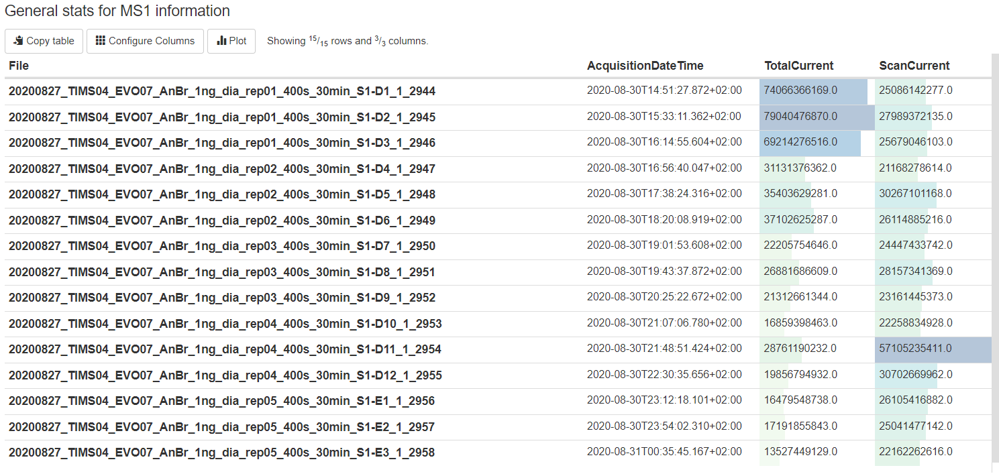

pMultiQC
========

`pMultiQC <https://github.com/bigbio/pmultiqc/>`_ is a python library for quality control (QC) proteomics based on `MultiQC <https://multiqc.info>`_ framework. pMultiQC provides quality charts for quality assessment of MS/MS proteomics experiments ranging from spectrum and peptide/protein identifications to quantitation results,  each plot is focused on a particular aspect of the data.

Acquisition performance heatmap
----------------------------------

The Acquisition performance heatmap allows users to compare the performance of different metrics for the different MS runs in the dataset. Each row of the heatmap correspond to a MS run while a column is a QC metric:

- **Contaminants**: It measures the number of contaminants proteins quantified.
- **Peptide Intensity**: Measures the total peptide intensity of the quantified peptides. Low peptide intensity usually goes hand in hand with low MS/MS identification rates and unfavourable signal/noise ratios, which makes signal detection harder. Also instrument acquisition time increases for trapping instruments.
- **Charge**: Measures the distribution of the charge states of all quantified peptides.
- **Missed cleavages**: This metrics capture the number of missed cleavages in the identified peptides.
- **ID rate over RT**: Judge column occupancy over retention time. Ideally, the LC gradient is chosen such that the number of identifications (here, after FDR filtering) is uniform over time, to ensure consistent instrument duty cycles. Sharp peaks and uneven distribution of identifications over time indicate potential for LC gradient optimization [MORUZ2014]_ .
- **MS2 oversampling**: An oversampled 3D-peak is defined as a peak whose peptide ion (same sequence and same charge state) was identified by at least two distinct MS2 spectra in the same Raw file. For high complexity samples, oversampling of individual 3D-peaks automatically leads to under sampling or even omission of other 3D-peaks, reducing the number of identified peptides. Oversampling occurs in low-complexity samples or long LC gradients, as well as undersized dynamic exclusion windows for data independent acquisitions.
- **Missing values**: Missing peptide intensities per MS run. This metric shows the fraction of missing peptides compared to all peptides seen in the whole experiment. The more Raw files you have, the higher this fraction is going to be If all Raw files are (technical) replicates, i.e. we can expect that missing peptides are indeed present and have an intensity similar to the peptides we do see, then the median is a good estimator. Peptides obtained via **Match-between-run (MBR)** are accounted for (i.e. are considered as present = non-missing).

Experimental design
--------------------------
The experimental design table shows the design of the proteomics experiments including: the name of the spectra file, fraction group, fraction, label, Sample accession, MSstats condition (condition), MSstats_Bioreplicate.

Summary Tables
---------------------------

The Summary Table and Pipeline Results Statistics describe the identification results of the analysis. The Summary Table summarize the total of MS/MS spectra, the number of identified MS/MS, the ratio of identified MS/MS, total number of proteins and peptides identified. The Pipeline Results Statistics represents the identification results by Ms runs including number of peptides, number of modified peptides and total number of identified proteins.

The MS1 subsection displays the total ion chromatograms curve, base peak chromatograms curve, distribution of peaks and general stats.

In addition, the **Spectra-Tracking** table reports the number of identified peptides and proteins by search engines comet (:doc:`comet`) or msgf (:doc:`msgf`).

Number of peptides per protein
---------------------------------

The Number of peptides per protein, displays the distribution of peptides per protein in the experiment. Proteins supported by more peptide identifications can constitute more confident results.

Summary of search engines scores
---------------------------------

These plots contain search scores and PEPs counts for different search engines in different files, and they also contain a summary of the consensus PSMs if two or more search engines are used.

Distribution of precursor charges
---------------------------------

This is a plot representing the distribution of the precursor ion charges for a given experiment. This information can be used to identify potential ionization problems including many 1+ charges from an ESI ionization source or an unexpected distribution of charges. An unexpected charge distribution may furthermore be caused by specific search engine parameter settings such as limiting the search to specific ion charges.

Peaks Intensity Distribution
-----------------------------

This is a plot representing the ion intensity vs. the frequency for all MS2 spectra in a whole given experiment. It shows the information for identified and unidentified spectra. This plot can give a general estimation of the noise level of the spectra. Generally, one should expect to have a high number of low intensity noise peaks with a low number of high intensity signal peaks. A disproportionate number of high signal peaks may indicate heavy spectrum pre-filtering or potential experimental problems.

Delta Mass distribution
-----------------------

This chart represents the distribution of the relative frequency of experimental precursor ion mass (m/z) - theoretical precursor ion mass (m/z).

Results exploration
-----------------------

pmultiqc uses two tables **Quantification Result** and **Peptide-Spectrum Matches** to enable the users to browse over quantified peptides and reported PSMs in the mzTab (:doc:`formats`).

.. tip:: Both tables allows the users to sort the results by columns and also **search** for the peptides of interest.

.. image:: images/pmultiqc-psms.png
   :width: 800
   :align: center

References
--------------------------

.. [MORUZ2014] Moruz L, Käll L. GradientOptimizer: an open-source graphical environment for calculating optimized gradients in reversed-phase liquid chromatography. Proteomics. 2014 Jun;14(12):1464-6. doi: 10.1002/pmic.201400036. Epub 2014 May 15. PMID: 24700534.
