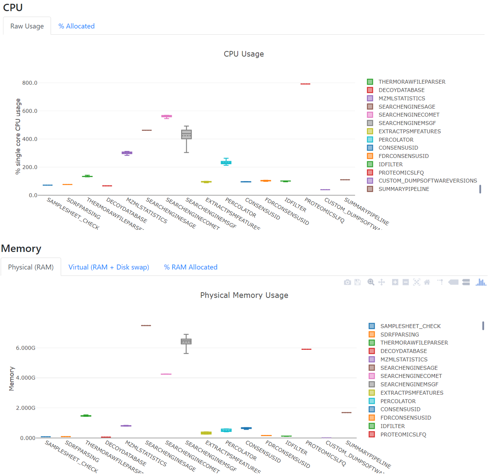

Sage search engine
===================

`Sage <https://github.com/lazear/sage>`_ [LAZ2023]_ is an **open source**, high-performance, and freely available proteomics search engines. Scalable and cloud-ready, 
Sage matches the performance of state-of-the-art software tools while running an order of magnitude faster.

.. note:: In quantms, Sage is in the middle of the pack in terms of number of identified PSMs, CPU usage and speed compared to MSGF+ and Comet.

In quantms, PSMs are exported from the search engine into .idXML (read more :doc:`formats`) without filtering for the re-scoring (see :doc:`identification`) step with percolator. The pipeline stores these original file results in the result folder under `searchenginesage`.

References
------------------

.. [LAZ2023] Lazear MR. Sage: An Open-Source Tool for Fast Proteomics Searching and Quantification at Scale. J Proteome Res. 2023 Nov 3;22(11):3652-3659. doi: 10.1021/acs.jproteome.3c00486. Epub 2023 Oct 11. PMID: 37819886.